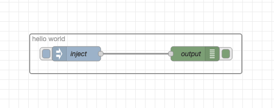
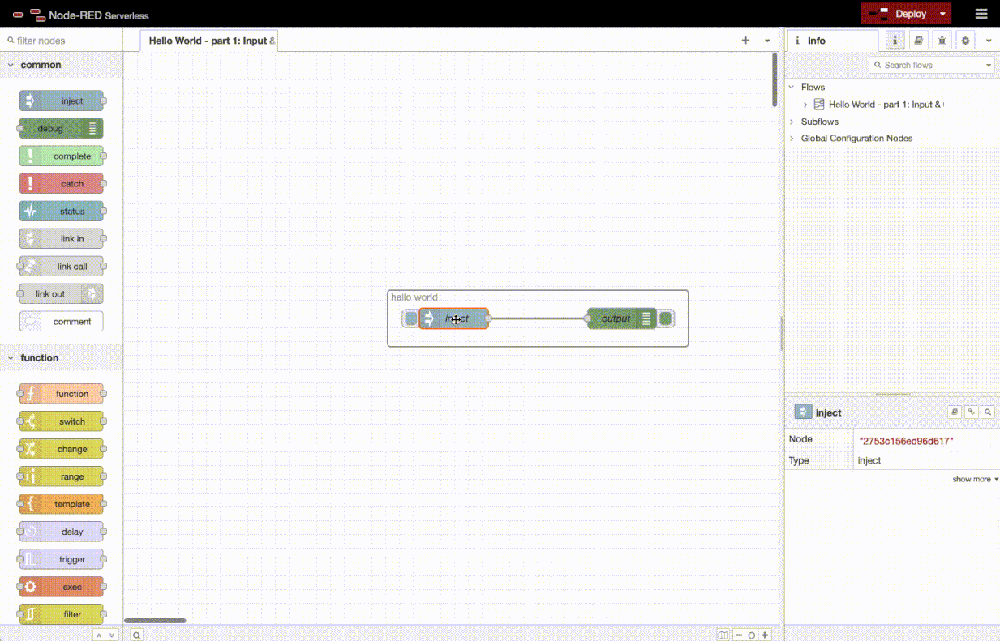
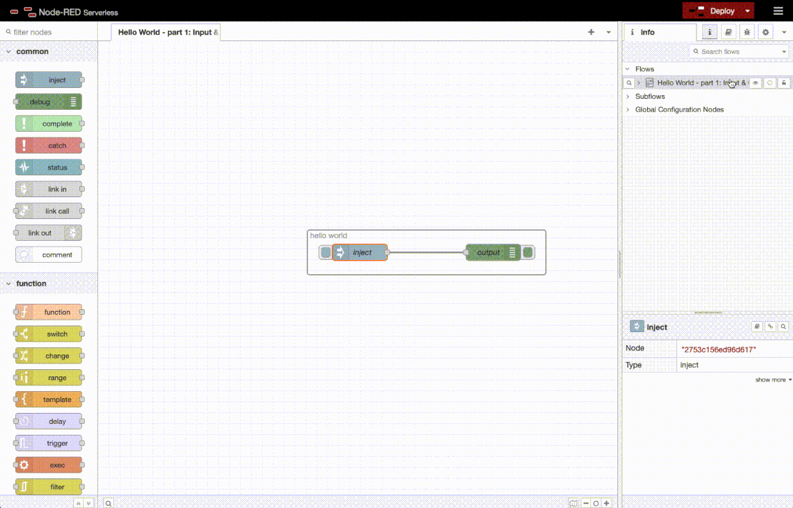

Development Strategy - Flow Driven Development
---

Node-RED being a flow based visual programming environment, there is no escaping the need to have flows to test functionality. Test flows provide a development guide to what needs implementation, what is broken and what was broken by new code.

But creating flows by using a text editor would be error prone and, in a word, insane! There is only one possibility: use the Node-RED flow editor to create and test flows - visually.

What I describe here is how to create flows, how to test them from within the Node-RED flow editor and how to implement node functionality in Erlang.

*Terminology*

Node-RED consists of two parts: 

- the flow editor that runs in the browser (jQuery + Javascript), and 
- the backend which executes flows (NodeJS).

The flow editor communicates with backend via a set of [API calls](https://flowhub.org/f/15cc9fb0e94d56cd). To make the flow editor work with a different backend, these API calls need to be emulated. That is what this [cowboy code](src/http) does.

It is the flow editor codebase that is [included here](node-red-frontend) in the project. The Node-RED NodeJS backend has been discarded and will be replaced by Erlang :)

*Step 1: Flows are Json arrays, understanding flow definitions*

The flow definition used by Node-RED is a single array of objects stored as Json files. There is no nesting of objects, there is no arrays of arrays: just one array containing all the nodes, tabs and groups the define a flow as objects.

Example flow:



That [flow](https://flowhub.org/f/7bac2d969ad2969f) (or view directly in [Node-RED](https://cdn.flowhub.org/?fhid=7bac2d969ad2969f&tk=&t=0#flow/7bac2d969ad2969f)) is represented by this Json:

```
[
    {
        "id": "7bac2d969ad2969f",
        "type": "tab",
        "label": "Hello World - part 1: Input & Output",
        "disabled": false,
        "info": "--- info text removed ---",
        "env": []
    },
    {
        "id": "14f2336960b44447",
        "type": "group",
        "z": "7bac2d969ad2969f",
        "name": "hello world",
        "style": {
            "label": true
        },
        "nodes": [
            "2753c156ed96d617",
            "501a10d8cc90b363"
        ],
        "x": 383,
        "y": 346,
        "w": 436,
        "h": 82
    },
    {
        "id": "2753c156ed96d617",
        "type": "inject",
        "z": "7bac2d969ad2969f",
        "g": "14f2336960b44447",
        "name": "inject",
        "props": [
            {
                "p": "payload"
            }
        ],
        "repeat": "",
        "crontab": "",
        "once": false,
        "onceDelay": 0.1,
        "topic": "",
        "payload": "hello world",
        "payloadType": "str",
        "x": 479,
        "y": 387,
        "wires": [
            [
                "501a10d8cc90b363"
            ]
        ]
    },
    {
        "id": "501a10d8cc90b363",
        "type": "debug",
        "z": "7bac2d969ad2969f",
        "g": "14f2336960b44447",
        "name": "output",
        "active": true,
        "tosidebar": true,
        "console": false,
        "tostatus": false,
        "complete": "payload",
        "targetType": "msg",
        "statusVal": "",
        "statusType": "auto",
        "x": 723,
        "y": 387,
        "wires": []
    }
]
```

Nodes have a type, in this case, `tab`, `group`, `inject` and `debug`. Types are not name-spaced, so types can be mirrored by malicious packages. Node-RED has a large collection of [node packages](https://flows.nodered.org/search?type=node) and there are checks in place to ensure universal type uniqueness.

Each node has a list of `wires` which represent the connections downstream from it. Each wire is a node id which should receive a message object once the node has completed its computation.

Other common attributes are:

- `z`  is the id of the flow tab in which the node is defined. The flow editor has many tabs in which flows many be defined. These flows can be interlinked using link nodes.
- `g` is the id of the group to which a node belongs - this might not be defined if the node does not belong to a group.
- `d` (not shown) is set to true if the node is disabled, in this example no node is disabled.
- `name` is the name of the node shown in the flow editor.
- `x` and`y` representing the location of the node within the flow editor. This makes it possible to view flows in [3D](https://flowhub.org/f/15cc9fb0e94d56cd/3d).

These are the most common, common attributes. In addition, each node defines its own set of node specific attributes, i.e., its configuration.

For example, the debug node from above:

```
        "active": true,
        "tosidebar": true,
        "console": false,
        "tostatus": false,
        "complete": "payload",
        "targetType": "msg",
        "statusVal": "",
        "statusType": "auto",
```

In this case, these attributes mean the following:

- `active true`: display messages in the flow editor
- `tosidebarbar true` : display messages in the sidebar within the flow editor
- `console false`: don't dump messages in the console window of the running server process
- ... I won't continue!

This functionality is partly implemented in [Erlang code](src/nodes/node_debug.erl). The same goes for the [inject node](src/nodes/node_inject.erl). Which also makes clear the naming convention of the code base: `node_<nodetype>.erl`.

For nodes that aren't implemented in Erlang, there is the [noop](src/nodes/node_noop.erl) node.

*Step 2: Accessing node details*

The flow editor makes easy to view the insides of nodes by using the export functionality (shortcut  via `ctrl-e` or `cmd-e`):



Individual nodes or the entire flow can be examined using that functionality.

It is important to implement nodes as they come, there must **not** be any Erlang specific attributes for nodes. All flows should be compatible with NodeJS based Node-RED and Erlang based Node-RED. Attributes value that  make no sense (for example `x` and `y`) can be safely **ignored** by the Erlang implementation.

How to know what attributes actually do?

I do this by trial & error: modify the configuration, try it out and make an guestimation. Also nodes are well documented within Node-RED, especially the core nodes:



Also the [NodeJS](https://github.com/node-red/node-red/tree/master/packages/node_modules/%40node-red/nodes) source code of the nodes is well documented and understandable.

*Step 3: Creating test flows*

The flow editor included here has been extended to include easy test case creation. I did this to simplify my life (and because I'm lazy). I added a "Create Test Case" button on the export panel from above:


 