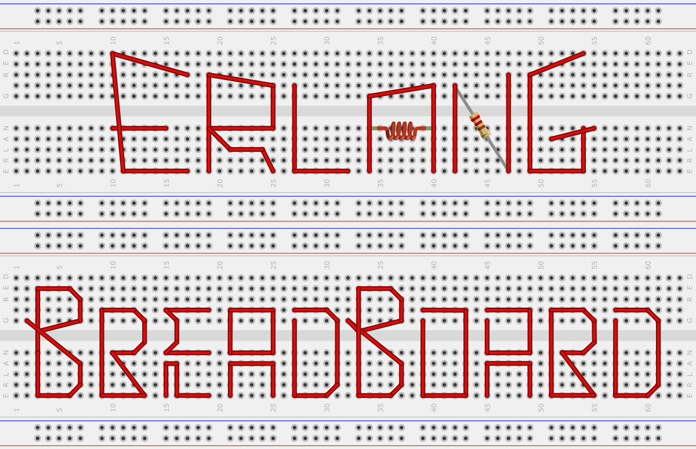
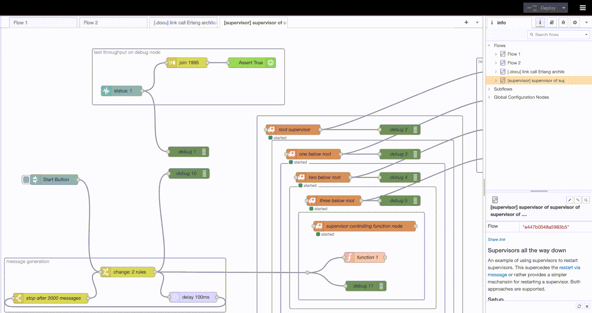
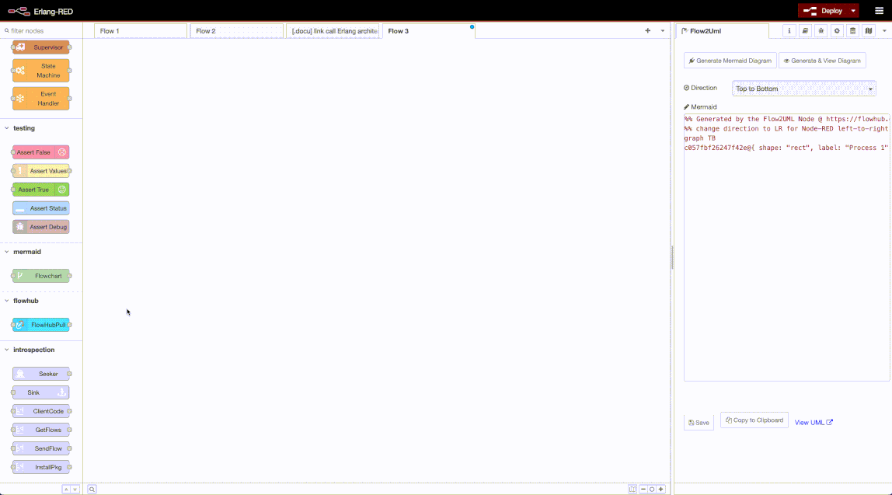
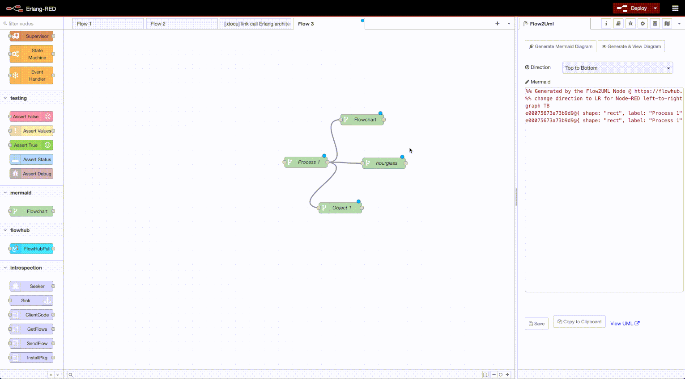
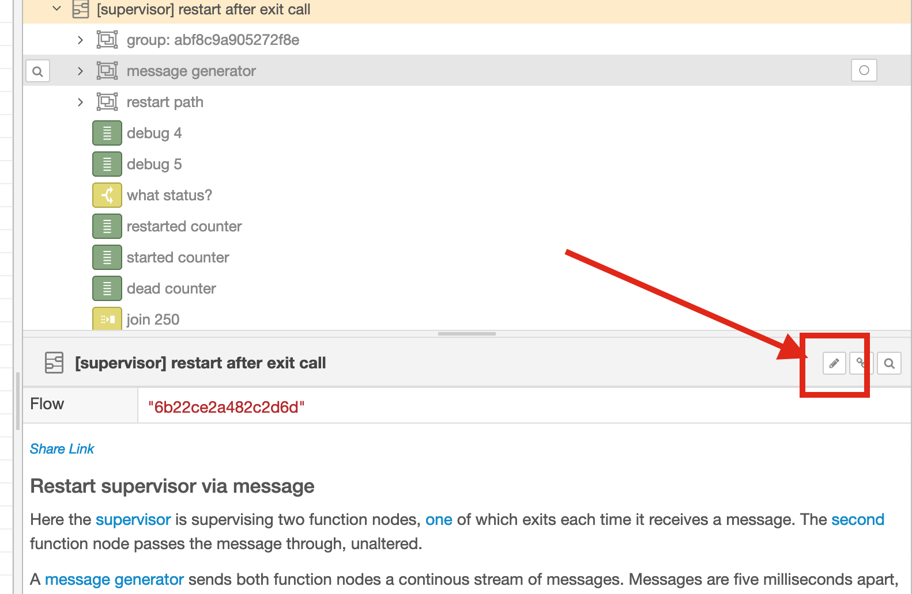
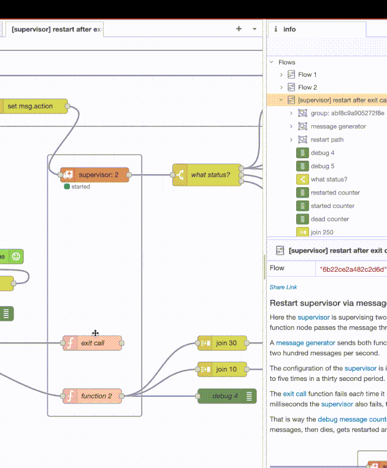
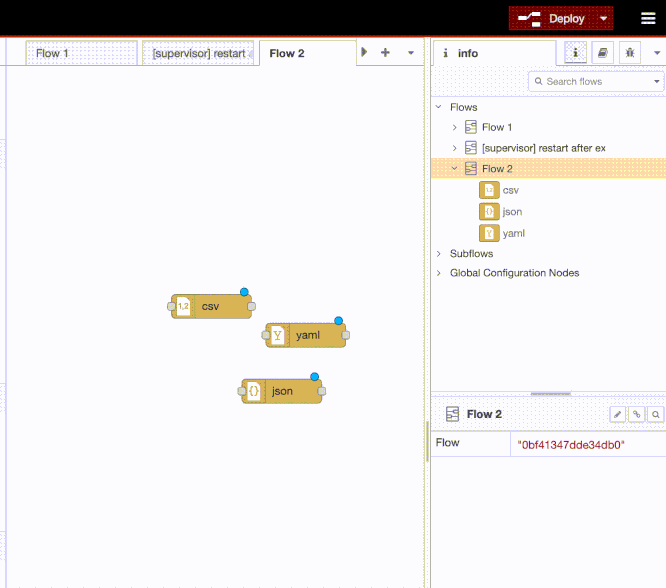
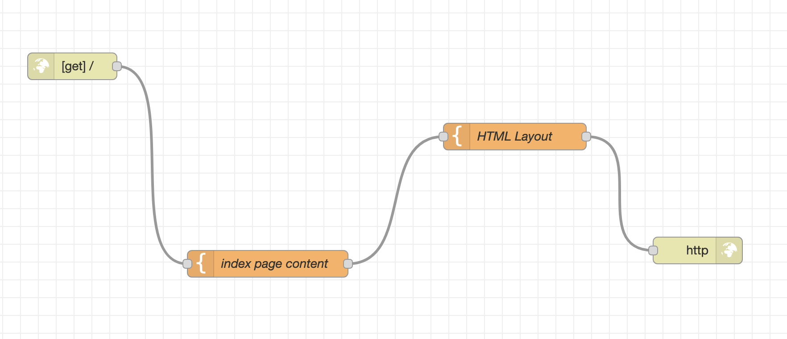

Milestones
---

*Milestones Six - m6*

Code Name: Milestone Six.

1. New Nodes: Tcp/IP, Event handler, Generic Server

    The main Erlang behaviours are now represented, `gen_server` and `gen_event` have now been included along with `gen_statem` and `supervisor`. All nodes are compatible with the supervisor node so restarts/stops can be modelled and implemented. Basically it is now possible to model complex Erlang architectures.

    Tcp nodes have also made it. These are implemented as close as possible to the original nodes defined in Node-RED. Their tests are still "in progress" but with the creation of the [MQTT broker](https://flows.red-erik.org/f/dc897f402c53697f) flow, the tcp nodes have a good testbed.

2. Breadboard Programming & AI ignorance

    > The concept of using breadboards as a prototyping technology in software development is an innovative idea that warrants exploration.

    AI thinks this is a [good idea](https://blog.openmindmap.org/breadboard-programming) so I went ahead and began using this terminology. I created two examples of what I mean by breadboard programming: [modelling a single tcp connection](https://flows.red-erik.org/f/bff27e059752cb60) and the [MQTT broker](https://flows.red-erik.org/f/dc897f402c53697f) from above.

    

    For me having another analogy of what I am doing here is very helpful. It provides a little bit of a focus compared to thinking of this project as being a "visual flow based programming environment for Erlang heavily influenced by Node-RED". I dunno, breadboard programming seems to be more marketable.

    Speaking of marketing, I also change the [license](https://github.com/gorenje/erlang-red/commit/b4c4dd49a611a0b445eef4f06cdaed7af75b133f) of the project to make it more "FAANG" compatible. Immediately I was [shoot down](https://discourse.nodered.org/t/node-vs-subflow-node-implementation-research/98012/14?u=gregorius) by other wisdom. F2k It: it's GPL all the way down, along with the turtles.

    Speaking of f2k it, I added an [`.aiignore`](.aiignore) file to indicate which artificially intelligent contributions are willingly accepted by the project. I didn't ask AI about this idea, I just found it good. Perhaps the idea will catch on for a way to identify "stuff" that is definitely human so that humans can train AIs to be better humans.

3. Better.['support'].for.["property"].access."types"

    Speaking of better, Node-RED has a [wickedly](https://discourse.nodered.org/t/when-array-and-when-object-key/98011) complex possibilities of accessing properties on the message object. I noticed this when implementing the MQTT broker from an [existing Node-RED flow](https://discourse.nodered.org/t/fun-exercise-make-an-mqtt-broker-in-node-red/82229). The [author](https://discourse.nodered.org/u/cymplecy/summary) used access methods that were new to me. So I went down the rabbit hole ....

    I ended up [creating](https://github.com/gorenje/erlang-red/commit/7b5af843b0378a441ec6e0fbbfd18c3ffd1f446d) a [parser](https://github.com/gorenje/erlang-red/blob/8b740c8860e78ab68ffabfdc6dc5400f97d71f90/src/erlang_red_attr_parser.yrl) for all the various possibilities and the [flow test](https://flows.red-erik.org/f/4d9e38557d6fbd2d) hopefully covers most cases ... although then there are [some edge-cases](https://flows.red-erik.org/f/459322e0f8e0b785) that I haven't yet implemented.

    The weirdness comes in when considering empty message objects on which values should be set. For example `msg.key1[2].key3 = "fubar"` will create this structure *automagically*:

    ```
    msg = { key1: [undefined, undefined, { key3: "fubar" } ] }
    ```

    So that `key1` becomes an array which contains an object at index 2 and `undefined` at index 0 and 1. This Node-RED does automagically because Javascript mixes accessing methods for hash and arrays. The '2' can be interpreted as a hash key or the number 2 as array index. And so when used as a string, as in `msg.key1['2'].key3 = "fubar"`, it becomes a hash key:

    ```
    msg = { key1: { '2': { key3: "fubar" } } } }
    ```

    And that makes all the fun and games of implementing this stuff. Either way, I managed to get things working mostly, aiming to be 100% compatible to what Node-RED does. Also: single quotes and double quotes are the same in Javascript and both represent a string.

    In Erlang-Red I modified that semantic to be that if a value is placed in single quotes, then it becomes and atom, so that `msg.key1['atom'].key3 = "fubar"` becomes:

    ```
    msg = #{ <<"key1">> => #{ atom => #{ <<"key3">> => <<"fubar">> } } }
    ```

    So 'atom' becomes `atom` and string keys become binaries. I decided to add atom support for accessing data that might come from an external data source or whatever. These property specifications can be used to access data as-well as setting data on the message object/map.

    As part of a [previous milestone](https://github.com/gorenje/erlang-red/commit/40e057f504be3daa8f58afbb4477db76f0f71259), I decided to change all map keys to binaries instead of a mix of atoms and binaries. It was a good decision to unify the key type - both because of atom limitations and consistency. That decision made implementing this much simpler.

    I do however use atoms for internal keys and that is good, since then its clear which keys are externally usable and which keys should be seen (i.e. debug log) but not touched. Most of the internal atoms also use an underscore prefix - another indication of their internalness.

4. Change, switch and inject nodes now support binary and buffer values

    The number field support in Node-RED is also very generous. Many forms of floating point numbers are supported and also binary and hexadecimal, both positive and [negative](https://github.com/node-red/node-red/issues/5208#issuecomment-3041138596).

    Turns out that it is so complex, that I had to build another [parser](https://github.com/gorenje/erlang-red/blob/8b740c8860e78ab68ffabfdc6dc5400f97d71f90/src/erlang_red_num_parser.yrl) just for handling the number field. All that parser does is transform Node-RED floating point representation to a representation understandable to Erlang. The [test flow](https://flows.red-erik.org/f/fb50bac16667fc54) attempts to cover many of those cases.

    As a consequence of creating the parser, I also began to support binary `0b1010101110110111100` values and hexadecimal `0xfeedd06` in the num field which is also a Node-RED thing. This then also lead to supporting the buffer field type which is nothing else than `JSON.parse([<<json arrray definitiona>>]).map( d => parseNumber(d) )` in [pseudo code](https://github.com/node-red/node-red/blob/a3563026a5ad5acb417ba34c7779e876cbc22451/packages/node_modules/%40node-red/nodes/core/function/15-change.js#L106) where `parseNumber` does the same as a num field above.

5. Breaking with Node-RED compatibility

    Having spoken of being compatible with Node-RED and aiming for magical 100% compatibility with Node-RED, I have decided that its never good to be 100%. Being the leader you lose motivation and continually look around you, worried about being overtaken. Mainstream is best, middle of the road, no need to succeed.

    And therefore I made a couple of changes to the core node defaults because they have always annoyed me - 1) the debug node dumps the entire message to the debug log instead of `msg.payload` as is default in Node-RED. That is because I implemented the dumping of specific [message attributes](https://github.com/gorenje/erlang-red/commit/52edd83f87c327d7bd5b12dfe8f0dde6febe0f53) to the debug log and now the Erlang-Red debug node would also inflict this default setting on me. Why do I prefer to dump the entire message? Because mostly my problems don't lie in the payload...

    Secondly the switch node has a "check all rules" by default setting. Imagine a case statement without breaks (not even but similar). Which I also dislike. I continually alter that default setting *every single time* I pull in a switch node in. So that the default in Erlang-Red is now "stop after first match" and if you want "check all rules" then you'll have to change it.

    My issue with "check all rules" is that it is extremely rare that you would want to be using that - perhaps this is an IoT thing or something that one does in industry - but me, I and myself, have - honestly - never needed to use that setting.

    Perhaps its also naming: *switch* for me is a switch statement, *filter* is a something else. This "check all values" makes the switch node into a filter node. Which reminds me: pity node aliases aren't supported - nice feature to be able to define a filter node that is a switch node but with a different setting. So that your personal settings can be defined as palette "nodes" but are actually just existing nodes.

    So anyway, F2k It bye-bye 100% Node-RED compatibility, hello freedom of authorship and experimentalism.


*Milestones Five - m5*

1. Erlang-Red Message Tracing

    Using the [introspection node package](https://flows.nodered.org/node/@gregoriusrippenstein/node-red-contrib-introspection), implemented message tracing of Erlang-Red messages.

    

    **Note**: that there are two types of messages in Erlang-Red - the Erlang type of messages and the Erlang-Red types of messages. A disadvantage of using a message passing based programming language to implement a message passing programming paradigm like flow-based programming! Either way, this feature traces Erlang-Red messages (the kind passed between nodes) and not Erlang messages (the kind passed between processes).

    A second point - related to the feature - message tracing can be activated at any time and does not require deploying the flow to the server, i.e., message of a live running server are being traced.

    A third point is that this feature was originally implemented for Node-RED and all I did was port the backend to Erlang. Now I have the same insights that I have in Node-RED but in Erlang-Red.

    One more point: this feature can definitely flood the flow editor into submission. Use with care. The server should be fine since all it is doing is sending messages out on a web-socket via an exclusive process for the web-socket connection.

    A fifth point: in the message tracing, the status of the node is abused to have a "msg received" status appear. That message (only in Erlang-Red) now contains the process id of the underlying Erlang process for the node.

2. Nodes for gen\_event & gen\_statem behaviours

    Erlang-Red has become more Erlang-like by not only implementing the supervisor behaviour but also the [gen_event](https://github.com/gorenje/erlang-red/blob/aa447d67d3f1893127897851750cb4e05cb5f8b8/src/nodes/ered_node_erleventhandler.erl) and [gen_statem](https://github.com/gorenje/erlang-red/blob/aa447d67d3f1893127897851750cb4e05cb5f8b8/src/nodes/ered_node_erlstatemachine.erl) behaviours. Both of these make use of the [module node](https://github.com/gorenje/erlang-red/blob/aa447d67d3f1893127897851750cb4e05cb5f8b8/src/nodes/ered_node_erlmodule.erl). The module node can be used to implement complete Erlang modules in Erlang-Red. These modules can then be used to define the behaviour of the gen_event and gen_statem nodes.

    The event handler is completely dynamic with modules being added as handlers at runtime, the state machine is static with a module being added at design time. A state machine handler can however dynamically replace the handler if so desired.

    The event handler will need some more TLC to make it static and dynamic. The overhead of configuring the event handler at runtime is strictly speaking not necessary. The corresponding test cases: [eventhandler](https://flows.red-erik.org/f/b70a7ce34819e4d5) and [state machine](https://flows.red-erik.org/f/5672fa442b2b881d).

    When I started out on this project (all of 2.5 months ago!), I intended to implement Node-RED features and nodes in Erlang. Now having created the Erlang-only nodes which implement these behaviours, I'm thinking that wouldn't it be nice to create Node-RED equivalent nodes. Half the work is done: these nodes are all packaged into an [Node-RED node package](https://flows.nodered.org/node/@gregoriusrippenstein/erlang-red-supervisor-node) and can be installed into Node-RED, only there they do nothing. However having a supervisor to ensure that things get restarted in NodeJS can be, perhaps, just maybe, also useful.

    The [assert nodes](https://flows.nodered.org/node/@gregoriusrippenstein/erlang-red-unittest) that I created actually do work with Node-RED and Erlang-Red, so these are the first ever nodes that are cross platform.

    The deeper philosophical point I'm trying to make here is that a visual flow-based programming approach can lead to cross pollination of programming ideas. It can also lead to interesting learnings around programming paradigms. But for those sceptical about visual programming and the benefits of it - especially how can a "serious" application be developed visually in a browser - go back to using punch cards. We came from giant mechanical calculators, went to punch cards then to keyboards and now we're stuck at Artificial Intelligence and typing in prompts to get code we might or might quite understand. Amazing, awesome, I'm so excited - truly. As programmers, we haven't started to use the true benefits of visually constructing our programs and applications, instead we claim that the keyboard is the only instrument for creating instructions for a piece of metal with many wires and many CPUs. Somehow it does remind me of knocking two stones together to make fire and the amazement when someone comes along with an Artificial Stone in the form of lighter.

3. Improved documentation using the Flow2UML node

    I dislike writing technical documentation. I consider code enough documentation - make the code read like a good murder mystery and presto it's a clear whodunnit. But Erlang code is damn compact and even I don't understand why and what I did two months ago. Not good. The second thing I dislike is creating flow diagrams - either visually or textually. But there is no way around it. If I want to be able to understand how things work in six months time, I have to create documentation.

    Mermaid seems to be the tool of choice for such things so back in the good days of Node-RED, I created a node package for converting [flows to Mermaid-UML-like](https://flows.nodered.org/node/@gregoriusrippenstein/node-red-contrib-flow2uml) diagrams, i.e. a flowchart. That flowchart, being defined in Mermaid syntax, can be embedded and displayed in Node-RED flow documentation - neat! But because I wanted extra features, I created the `mermaid-flowchart` node for creating more complex flowcharts.

    Some examples are [here](https://flows.red-erik.org/f/6316ee59f55d37bf), [here](https://flowhub.org/f/4c19635d7c95e596) and [here](https://flowhub.org/f/ee56b79ce65025e8). And inside Erlang-Red:

    

    But creation is one thing, usage is another - how I do use these diagrams? Well Node-RED supports embedded mermaid diagrams and by extension, so does Erlang-Red:

    

    That's the nice thing, the documentation of a flow is *embedded* in the flow and goes wherever the flow goes. I created red-erik.org to host that documentation in a webpage. So for example,  the gif above is [online](https://flows.red-erik.org/f/c4c29c2fd5665ed9) at red-erik.org.

    For any Node-RED readers: the original flow2UML package also contains the new mermaid flowchart node. So it's possible to create these complex flowcharts in Node-RED also.

4. Timeout support for function and link-call nodes

    This might seem minor, but both required a complete re-think of the Erlang architecture. The function node now creates up to two Erlang processes *per* Erlang-Red message received. The Erlang architecture for the function node is [documented](https://flows.red-erik.org/f/1fd621a674360b5d) and describes why this needs to be.

    Timeout for the link-call node was much simpler since it can be implemented using the Erlang-Red message object. Basically an `erlang:start_timer` is set when the Erlang-Red message is passed onto the link-in node. If the message comes back before the timer is triggered, the timer is cancelled. If on the other hand, the message isn't received, the timer is triggered and a timeout error is raised. In creating the [unit test](https://flows.red-erik.org/f/b6d4e4592b27a344) for this feature, I realised that the message - once it arrived - is *still* passed on! That is Node-RED behaviour, so Erlang-RED copied that. IMHO that doesn't make sense since the message timed-out, however I can understand that if the message makes it back, then why lose the data - obviously took a long time to get it, so don't waste it!

5. Better documentation describing the Erlang architecture

    I am starting to be happy with the Erlang architecture so I've started to document it. Starting with the [supervisor node](https://flows.red-erik.org/f/211405fa9e8a6f9b), a technical description of how it interacts with the Erlang code base to implement Erlang-Red node supervision using Erlang process supervision. There is technical description of how the [link call](https://flows.red-erik.org/f/43e8af136f4d0fbe) node works.

    Once I'm through with documenting everything, I will probably end up modifying everything again - programming is truly a Sisyphusian activity.

*Milestone Four - m4*

1. Supervisor Node

    One of the most important concepts of Erlang is the [supervisor behaviour](https://www.erlang.org/doc/system/sup_princ.html). It defines an elegant approach for monitoring, restarting and stopping processes that are unhealthy. It thus allows for complex yet stable architectures to be created in Erlang. Erlang-Red now has its very own supervisor node to provide the same behaviour but *visually*.

    The supervisor node is fully feature compatible to the supervisor behaviour and the node provides a simple mechanism of selecting nodes to be supervised and also ordered. Supervisors have a specific ordering of processes and this is also supported by the supervisor node by being able to sort nodes, each node being a process.

2. Added Pencil to Flow-editor

    

    Might seem silly but it is important for documentation. Test flows can now be viewed over at Red-Erik.org (hosted via [flowhub.org](https://flowhub.org)), so that test flows can now be better documented via "pink link technology", for example, [flow one](https://flows.red-erik.org/f/6b22ce2a482c2d6d), [flow two](https://flows.red-erik.org/f/e447b0048a5983b5) and [flow three](https://flows.red-erik.org/f/3afa3b2ec00a5e3d).

    Pink links highlight nodes and groups in the flow diagram making it simpler to explain flows within the flow description. These pink links are a html stanzas, e.g.:  ```<a class='ahl-group-only' data-ids='0bf41347dde34db0'>name</a>``` - which are a *real* pain to write by hand. Node ids had to be copied, the class name typed out, node ids found from the flow editor ... blah blah :(

    Also important to note is that flow documentations is found via the flow tab:

    

    This means that flow documentation lives with the flow code and is displayed both in Erlang-Red (within the flow editor) *and* at flows.red-erik.org. (All acknowledgement to the [Node-RED team](https://github.com/node-red/node-red/graphs/contributors) for putting this in the editor, I am just piggy-backing their work and extending it to my needs.)

    Back to the pencil: I now select a node or group from the info panel and click on the pencil and I have my HTML stanza:

    

    The nice thing is that the info panel is usable while editing the documentation for a flow, so the pencil can always be used to create the HTML stanza for the pink links.

3. FlowHubPull node: dynamic flow code loading

    [FlowHub.org](https://flowhub.org) is my attempt at creating a visual code hosting platform. Part of that is defining interdependencies between flows. For me a flow is the flow tab (for others a "Flow" are all flow tabs). I like to think in flow tabs and creating functionality that fits into a [single flow tab](https://flowhub.org/f/c520d9da20ad7f1d).

    Flows can be linked via the link nodes and I do this very often. But what is missing is the loading of flows into Erlang-Red dynamically. So for example, [this test flow](https://flows.red-erik.org/f/048a36525238b2e7) first triggers the flow hub pull node to load another flow into Erlang-Red. It then triggers the test which contains a link to the [other flow](https://flows.red-erik.org/f/641ddaab2819c61d).

    The FlowHub pull node is currently limited to the flows contained within the Erlang-Red [test-suite](https://github.com/gorenje/erlang-red/tree/main/priv/testflows) but there isn't any reason - other than laziness - why this cannot be extended to include other sources of flow code.

4. Remove catch around function node

    With the introduction of a supervisor node, I removed the [exception handling](https://github.com/gorenje/erlang-red/commit/5617f3fcbdd49d36ad95adee2a471719377370c1#diff-b812aee125e472bd96c84632968be04bfe9dc0cc8afee1186994fbeae9cb9e86R115) around the function node - I actually had to do this to get the function node to fail (was using a divide by zero error to test the supervisor node).

    But it made me realise that Erlang is a lot different to NodeJS when it comes to exception handling. Erlang processes are lightweight and designed to fail, so let them fail becomes the intention. NodeJS on the other hand wants to handle all exceptions and not let the system get unstable, so there is much use of the try-catch-final pattern within NodeJS code.

    Erlang heals systems by restarting processes if they fail. It is assumed the system is stable until something fails. Perhaps the complete inverse of what NodeJS does.

    By removing the catch block on the function node, I'm moving away from the NodeJS way of doing things and moving towards a more Erlang-like approach.

    Ironically the problem with catching errors in something as generic as the function node (which takes straight up Erlang code and executes the code) is that: how to deal with the exceptions? All I was doing was pushing it to the debug panel ... but I could do that far more descriptively by using a catch node connected to a debug node.

    Its only a minor change yet  it represents a major step forward for Erlang-Red because it allows Erlang folks to think in terms of Erlang when using Erlang-Red.

    Additionally Erlang-Red now has two nodes for error handling: catch node for catching exceptions and the supervisor node for restarting failing processes. As they say in German: *twice holds better*!

5. Erlang, Elixir, BEAM?

    Tried but [failed](https://github.com/gorenje/erlang-red/issues/15) to get Erlang-Red compiling in an Elixir environment. It does so but then Erlang-Red won't compile in an Erlang environment. I decided to focus on the Erlang path - after all its Erlang-Red not [BEAM-Red](https://github.com/gorenje/erlang-red/discussions/14). My experience is not up to getting Erlang-Red to compile for both Elixir and Erlang, perhaps someone else will make in-roads there.


*Milestone Three - m3*

1. Elixir code constructively includable.

    Since Elixir also runs on the BEAM VM and there are some libraries that aren't available in Erlang, I made an effort to integrate third party Elixir libraries - in a structured manner - into the codebase of Erlang-RED. Many thanks to [@filmor](https://github.com/filmor) for the tip of using their [exerl](https://github.com/filmor/exerl) plugin. Works like a charm!

    This effort lead to  two new nodes using Elixir codebases: the [markdown node](src/nodes/ered_node_markdown.erl) uses [earmark](https://github.com/pragdave/earmark) and the [csv node](src/nodes/ered_node_csv.erl) uses [nimble_csv](https://github.com/dashbitco/nimble_csv).  Nimble might be removed again since there are pure Erlang CSV libraries - we'll see.

2. Erlang JSONata has moved out

	  Moved the codebase for the JSONata parser out into its own [repository](https://github.com/gorenje/erlang-red-jsonata). I wasn't actively extending it and moving it out will allow others to extend and add to the JSONata functionality supported in Erlang-RED. It's always sad when the children move out but its for the best!

3. Function node in Erlang!

    One of the more important nodes in Node-RED is the function node because it allows for creating Javascript code, i.e., dropping down to high-code instead of low-code. This can be helpful for adding functionality to a flow that is not covered by any available node. What the function node offers is syntax highlighting and error highlighting in code. This makes it a mini editor inside of Node-RED.

    An initial emulation of this this for Erlang has been made so that Erlang-RED flows can now also speak Erlang. The implementation is still rudimentary but it shows what needs to be done to get this happening. A function provides much power and the Erlang one is no different - i.e. it's a window into the server hosting Erlang-RED. So a sandbox needs to be created and much thought into how to ensure that nothing breaks or gets maliciously damaged.

    **Use at own risk!** is the conclusion.

4. Add FlowHub.org nodes for managing flow test cases

     [FlowHub.org](https://flowhub.org) is my attempt to make visual programming truly visual. One of the first things I did was to create a visualisation of Node-RED outside of Node-RED, i.e., flows [displayed in webpages](https://github.com/gorenje/node-red-flowviewer-js). From that initial effort, FlowHub.org was created to support visual version controlling of flow code - both inside of Node-RED/Erlang-RED and also externally via a website.

     Adding FlowHub to Erlang-RED now allows me to maintain the test flow [repository](https://github.com/gorenje/erlang-red-flow-testsuite) and easily import tests into either Node-RED or Erlang-RED - with the same consistent interface. As an aside: FlowHub is also coded in Node-RED, i.e., dog-fooding all the way down to the turtles.

5. [Red-Erik.org](https://red-erik.org) utilises multiple flows

    The initial release of Red-Erik was based on a single, now its a multiple flow monster! Why is this important? Because it ensures that the link nodes work across multiple flows - this is their main purposes. Also it made me think about how I could get Erlang-RED to execute multiple flows. In doing so, it became clear that executing and designing flows are very much different activities. When the flows get executed, they basically just become an Erlang architecture of processes, nothing remains of the original flows. Each process only knows where to send its messages to - when it receives a message. There is no overall structure of the flow in memory. This is great because there is no overhead to maintain such a structure.

*Milestone Two - m2*

1. JSONata parser and evaluator

    [JSONata](https://jsonata.org) is a transformation language for JSON objects that is heavily used in Node-RED. Within Node-RED it provides a vital function by offering functionality for manipulating the msg object (i.e., the data flow) without having to code Javascript code. Because of this and also wanting to be 100% compatible with NodeRED, I created a [JSONata parser](https://github.com/gorenje/erlang-red/blob/b788c04d3a2b694da908d864e5d554434e4453ea/src/jsonata_parser.erl) in Erlang and implemented basic functionality that JSONata provides. The parser is defined in [yecc](https://www.erlang.org/doc/apps/parsetools/yecc.html) and can be easily extended in either the [evaluator](https://github.com/gorenje/erlang-red/blob/b788c04d3a2b694da908d864e5d554434e4453ea/src/jsonata/jsonata_evaluator.erl#L46-L101) or in the [yecc definition](https://github.com/gorenje/erlang-red/blob/b788c04d3a2b694da908d864e5d554434e4453ea/src/jsonata_parser.yrl#L205-L485). Having JSONata support is a major step forward for the Erlang-RED!

2. External Connectivity: network connectivity via HTTP-in and MQTT nodes, command connectivity via the exec node

     Having spent the initial part of the project developing the routing and flow control nodes, this milestone has three new nodes for accessing the external world.

     The [HTTP in](https://github.com/gorenje/erlang-red/blob/b788c04d3a2b694da908d864e5d554434e4453ea/src/nodes/ered_node_http_in.erl) is my personal favourite because with it, it is possible to do [static http routing](https://ered.fly.dev/node-red?tstid=f346d45c81f595e5) within Erlang-RED. Even better, combined with the dynamic linking of the [link nodes](https://github.com/gorenje/erlang-red/blob/b788c04d3a2b694da908d864e5d554434e4453ea/src/nodes/ered_node_link_call.erl#L59-L86), it is even possible to do [dynamic web routing](https://ered.fly.dev/node-red?tstid=c562c43e69bcf0af).

     MQTT [nodes](https://github.com/gorenje/erlang-red/blob/b0092cf01bdc2333e03dab60485dd018faaae9f8/src/nodes/ered_node_mqtt_in.erl) provide message bus connectivity. The mqtt nodes are particularly useful for connectivity between Erlang-RED and NodeRED: it is now trivial to have instances of Erlang-RED communicate with NodeRED.

     Exec node can be used to shell-out to a new process. Finally it is possible to read `cat /etc/passwd` using Erlang-RED - have hours of fun and games with family and friends by hacking each other installation of Erlang-RED ;)

     With these three nodes done, it is possible to create applications for routing MQTT traffic or HTTP traffic to MQTT or vice versa.

3. 100+ Visual test flows for ensuring compatibility

    There are just over 100 visual flow tests to ensure that Erlang-RED nodes are compatible with the current Node-RED functionality. These "test" flows can be utilised by other projects (e.g. [Py-RED](https://github.com/mdkrieg/py-red)) to also ensure compatibility or by NodeRED itself for regression testing.

    Creating these flows has also given me insights into the specifics of existing nodes. It also lead to [pull requests](https://discourse.nodered.org/t/complete-split-is-the-value-wrong/96650) for the original NodeRED.

    In the long term, I will push these tests to a separate repository so that they are independent of the project.

4. Internal architecture for utilising third party Erlang libraries

    With the implementation of [mqtt nodes](https://github.com/gorenje/erlang-red/blob/b788c04d3a2b694da908d864e5d554434e4453ea/src/nodes/ered_node_mqtt_in.erl) using the [emqtt library](https://github.com/emqx/emqtt) it became clear that each library will need a [manager](https://github.com/gorenje/erlang-red/blob/b0092cf01bdc2333e03dab60485dd018faaae9f8/src/managers/ered_mqtt_manager.erl) for handling communication between the node and the library.

    This pattern was also implemented for the [exec node](https://github.com/gorenje/erlang-red/blob/b788c04d3a2b694da908d864e5d554434e4453ea/src/nodes/ered_node_exec.erl) that utilises the [erlexec](https://github.com/saleyn/erlexec) library and which has a [manager](https://github.com/gorenje/erlang-red/blob/b0092cf01bdc2333e03dab60485dd018faaae9f8/src/managers/ered_exec_manager.erl) to coordinate the message passing between erlexec and the exec node.

    What I learnt was that libraries generate messages and if these are sent directly to the node, then the [node behaviour](https://github.com/gorenje/erlang-red/blob/b788c04d3a2b694da908d864e5d554434e4453ea/src/ered_node.erl#L70-L169) would become chaos. I am torn between having [generic messages](https://github.com/gorenje/erlang-red/blob/b0092cf01bdc2333e03dab60485dd018faaae9f8/src/ered_node.erl#L118-L128) and passing them off the individual nodes and being strict on the set of message that a node can receive.

    But having a manager is actually the tie-breaker, being able to remove library specific code to the manger while the node concentrates on "node specific" functionality is optimal. Done right, it should be possible to replace third-party libraries without modification to the node code. What is node specific functionality? Something like ensure that its [status](https://github.com/gorenje/erlang-red/blob/b0092cf01bdc2333e03dab60485dd018faaae9f8/src/nodes/ered_node_delay.erl#L70-L80) is displayed correctly - in this case the messages waiting at a delay node.

    Division of responsibility is simple when nodes worry about their status and managers about external resources.

5. https://red-erik.org the very first Erlang-RED application

    Red-Erik.org represents an initial headless installation of Erlang-RED. The flow being [executed](https://github.com/gorenje/erlang-red/blob/main/priv/testflows/flow.499288ab4007ac6a.json) consists of a http-in node listening to the '/' path, two template nodes the contain the contents of the page and a http-response node that sends back the content when requested.

    

    It is oxymoronic to speak of a "flow executing" since what actually happens is that the flow represents a blueprint for an Erlang architecture. When the [docker image](https://github.com/gorenje/erlang-red/blob/b0092cf01bdc2333e03dab60485dd018faaae9f8/Dockerfile.heroku) spins up, the Erlang processes are created (four - one the http in, two for two template nodes and one for the http response node) and then messages are sent.

    The processes aren't wired together, all that happens is that the http-in node will send a message when a request from a browser is received. That message goes to the first template node that sends it on to the second template node after modifying the message to contain its payload. Using a [mustache](https://mustache.github.io/)  template, the second template inserts the payload into a html layout. That is then sent to the http respond node that is connected to the second template. The http respond node sends the response to the client.

    So the flow specification is exactly that: a specification for a bunch Erlang processes that are completely independent of one another.


*Milestone One - m1*

1. Working integration of Erlang and Node-RED flow editor

	  Static flow editor frontend [codebase](https://github.com/gorenje/erlang-red/tree/m1/priv/node-red-frontend) communicates with Erlang via [http endpoints](https://github.com/gorenje/erlang-red/blob/m1/src/servers/ered_webserver.erl). Flow editor codebase is retrieved from a running Node-RED instance using a well defined [script](https://github.com/gorenje/erlang-red/blob/m1/priv/node-red-frontend/retrieve.sh). A clear path to updating the flow editor is thus assured: updates to the live instance are reflected in the static version in the project.

2. Erlang codebase

	  The basic shape of an Erlang project has been followed. Initially project codebase was unstructured but [many](https://erlangforums.com/t/erlang-red-erlang-interpreter-for-node-red-flow-code-visual-flow-based-programming/4678) at the Erlang forum helped to improve that structure and form it in to proper Erlang codebase. Using rebar3 for release and build management, eunit for testing and `ered_` as project prefix.

3. Erlang Architecture stabilised - Supervisors and Processes all the way down.

	  Main [gen_server components](https://github.com/gorenje/erlang-red/tree/m1/src/servers) are placed under [supervision](https://github.com/gorenje/erlang-red/blob/m1/src/erlang_red_sup.erl) to ensure stability. Nodes are [gen_server processes](https://github.com/gorenje/erlang-red/blob/m1/src/ered_node.erl) but are not placed under  supervision be will be in the long term. The ideas behind the architecture have been [documented](https://github.com/gorenje/erlang-red/blob/m1/Architecture.md).

4. Initial collection of *implemented* nodes

	  An [initial](https://github.com/gorenje/erlang-red/tree/m1/src/nodes) collection of nodes have been implemented, they are not feature complete but provide the basis for initial testing. The intention is to create as many nodes as possible to ensure that the underlying architecture supports these nodes. Feature completeness will hopefully not affect the architecture in the same way as initial creation. Using the testing panel within the flow editor, it is possible to check what works and what does not.


5. Flow Driven Development Process

	  A collection of approximately sixty [flow tests](https://github.com/gorenje/erlang-red/tree/m1/priv/testflows) have be created to support development. The idea is to develop these flows in conjunction with a working Node-RED installation and then transport these flows here. Erlang-RED Nodes are then developed until the functionality is implemented, that is, until the test passes. Test flows can also be marked as pending (using the [flow environment](https://github.com/gorenje/erlang-red/blob/m1/priv/testflows/flow.6ff45e2a0ce77393.json#L10-L12) so that future functionality can be staked out. This development process has also be [documented](https://github.com/gorenje/erlang-red/blob/m1/DevelopmentStrategy.md).


---

Milestones are spots in the life of the codebase where everything comes together and there is stability. Milestones are not planned, they are discovered once reached. Milestones have no relation to versions.
