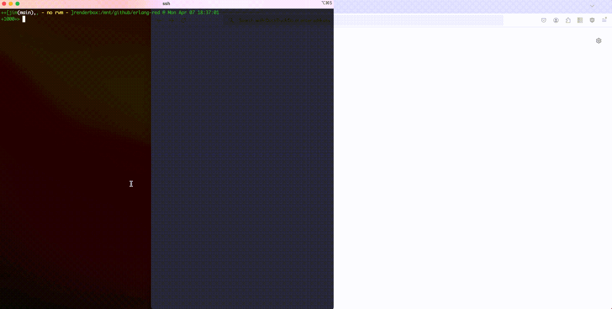
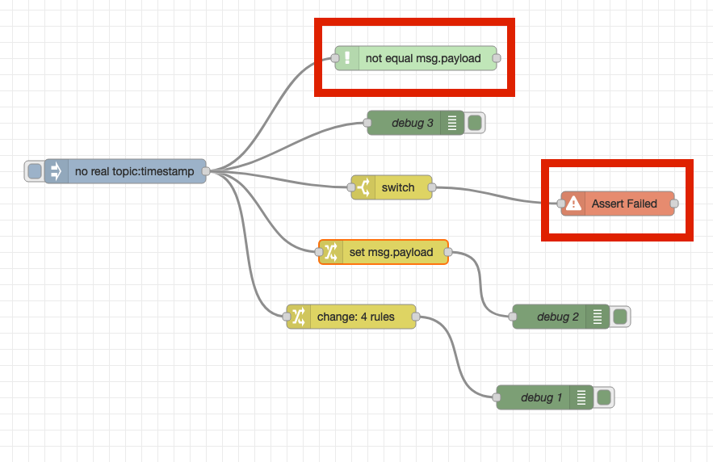
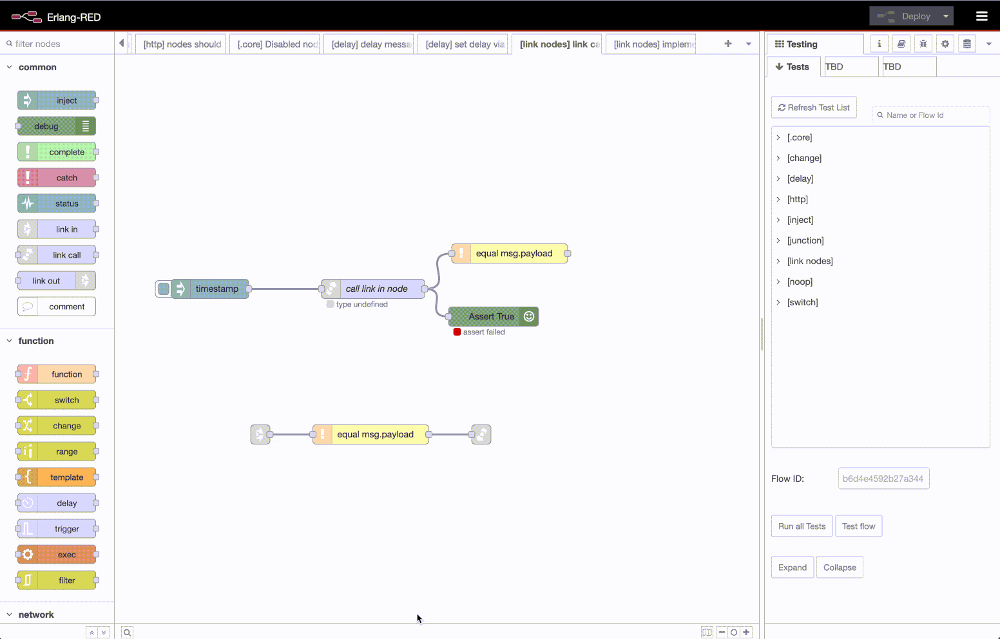

Erlang-RED - A Node-RED backend coded in Erlang
=====

An experiment to replace Node-REDs existing NodeJS backend with an Erlang equivalent that is 100% compatible[1] to existing flow code.

The goal is bring the advantages of low-code visual [flow-based programming](https://jpaulm.github.io/fbp/index.html) to a programming language that is designed for message passing and concurrency from the ground up, hence Erlang.

[1] = 100% won't be possible since function nodes that are coded in Javascript aren't supported (or aren't intended to be supported - unless someone has a workaround)

Why?
---

[Node-RED](https://nodered.org) is a amazing[*] tool for creating flows that describe concurrent processing, it is just a shame the NodeJS is single threaded. So why not use something that is multi-process from the ground up? Concurrency is guaranteed and included.

Also Erlang isn't the most understandable of programming language - unless one has fallen into in a [cauldron](https://en.wikipedia.org/wiki/Obelix) of Prolog, spiced with Lisp.

So won't it be great to have the simplicity of low-code visual flow based programming and the performance (and concurrency) of Erlang?

[*] = amazing in the sense of *extendability* (Nodes can easily be added and developed by third parties), *understandability* (Node-RED [terminology](https://blog.openmindmap.org/blog/pipes-wires-nodes) is straightforward) and *usability* (once a rectangle becomes a unit of computation and a line becomes a pathway for data flow)

Development Strategy
---

My development process is best described as [flow driven development](DevelopmentStrategy.md) based around a set of [test flows](priv/testflows) to ensure that node functionality is implemented correctly - meaning that it matches the existing Node-RED functionality.

Test flows are mirrored in a separate [repository](https://github.com/gorenje/erlang-red-flow-testsuite) for better maintainability and also integration with existing Node-RED installations.

Architecture
----

The architecture, along with a background to Flow Based Programming and Node-RED has been [written](Architecture.md).

The codebase as it stands, has many interdependence because of testing flows: [assert nodes](https://github.com/gorenje/erlang-red/blob/e2bd2f324ddc1bbe611dff29216246b80151ffc0/src/nodes/ered_node_assert_status.erl#L109-L131) need to know about [web-socket communication](https://github.com/gorenje/erlang-red/blob/e2bd2f324ddc1bbe611dff29216246b80151ffc0/src/servers/ered_ws_event_exchange.erl), or because of the nature of nodes: the [complete](https://github.com/gorenje/erlang-red/blob/e2bd2f324ddc1bbe611dff29216246b80151ffc0/src/nodes/ered_node_complete.erl#L74-L89) node needs to know of [completed messages](https://github.com/gorenje/erlang-red/blob/e2bd2f324ddc1bbe611dff29216246b80151ffc0/src/exchanges/ered_message_exchange.erl#L36-L39).

While the [exception node](https://github.com/gorenje/erlang-red/blob/e2bd2f324ddc1bbe611dff29216246b80151ffc0/src/nodes/ered_node_catch.erl#L40) needs to know about exceptions when they [happen](https://github.com/gorenje/erlang-red/blob/e2bd2f324ddc1bbe611dff29216246b80151ffc0/src/exchanges/ered_message_exchange.erl#L46-L56).

An architectural diagram of this interconnectedness would be probably be just as confusing as the code itself.

Supported Nodes & Features
---

This is a non-complete list of nodes that partially or completely work:

| Node | Comment |
| ---- | ------- |
| [catch](src/nodes/ered_node_catch.erl) | catches exception of selected nodes and of entire flows but not groups |
| [change](src/nodes/ered_node_change.erl) | supports many operators but not all. JSONata in basic form is also supported. |
| [complete](src/nodes/ered_node_complete.erl) | is available and can be used on certain nodes, not all |
| [csv](src/nodes/ered_node_csv.erl) | initial RFC4180 decoder working, supports only comma separator |
| [debug](src/nodes/ered_node_debug.erl) | only debugs the entire message, individal msg properties aren't supported. msg count as status is supported. |
| [delay](src/nodes/ered_node_delay.erl) | supported static delay not dynamic delay set via `msg.delay` |
| [exec](src/nodes/ered_node_exec.erl) | executing and killing commands is supported  but only for commands in spawn mode and set on the node. Appending arguments to commands isn't supported. Timeouts are supported. Kill messages are also supported. |
| [file in](src/nodes/ered_node_file_in.erl) | working for files located in `/priv` |
| [function](src/nodes/ered_node_function.erl) | working for any Erlang. Stop and start also respected. Timeout and more than one output port isn't supported. |
| [http in](src/nodes/ered_node_http_in.erl) | working for GET and POST, not available for PUT,DELETE etc |
| [http request](src/nodes/ered_node_http_request.erl) | basic support for doing rrequests, anything complex probably won't work |
| [http response](src/nodes/ered_node_http_response.erl) | working |
| [inject](src/nodes/ered_node_inject.erl) | working for most types except for flow, global ... |
| [join](src/nodes/ered_node_join.erl) | *manual arrays of count X* is working, `parts` isn't supported  |
| [json](src/nodes/ered_node_json.erl) | working |
| [junction](src/nodes/ered_node_junction.erl) | working |
| [link call](src/nodes/ered_node_link_call.erl) | working - dynamic calls also |
| [link in](src/nodes/ered_node_link_in.erl) | working |
| [link out](src/nodes/ered_node_link_out.erl) | working |
| [markdown](src/nodes/ered_node_markdown.erl) | working and supports whatever [earmark](https://github.com/pragdave/earmark) supports. |
| [mqtt in](src/nodes/ered_node_mqtt_in.erl) | should be working |
| [mqtt out](src/nodes/ered_node_mqtt_out.erl) | should be working |
| [noop](src/nodes/ered_node_noop.erl) | doing nothing is very much supported |
| [split](src/nodes/ered_node_split.erl) | splitting arrays into individual messages is supported, string, buffers and objects aren't. |
| [status](src/nodes/ered_node_status.erl) | working |
| [switch](src/nodes/ered_node_switch.erl) | most operators work along with basic JSONata expressions  |
| [template](src/nodes/ered_node_template.erl) | mustache templating is working but parsing into JSON or YAML isn't supported |
| [trigger](src/nodes/ered_node_trigger.erl) | the default settings should work |

- Contexts are **not supported**, so there is no setting things on `flow`, `node` or `global`.

- [JSONata](https://jsonata.org) has been **partially implemented** by the [jsonata parser](src/jsonata_parser.yrl). Most functionality isn't supported but can be [added to the evaluator](src/jsonata/jsonata_evaluator.erl).

Elixir & Erlang-RED
---

Elixir helpers can be added to [erlang-red-elixir-helpers](https://github.com/gorenje/erlang-red-elixir-helpers) repository.

There is nothing stopping anyone from creating a complete node in Elixir provided there is a Erlang "node-wrapper", i.e., a bit of Erlang code in the [src/nodes](src/nodes) directory that references the Elixir node.

The initial example [markdown node](https://github.com/gorenje/erlang-red/blob/42f10112baac5a5f916ecd805eafc87382632dec/src/nodes/ered_node_markdown.erl#L38) is an Erlang node that references Elixir code. I also wrote an Elixir wrapper function whereby I could have just as easily referenced Earmark directly from the Erlang code. That was a stylist choice.

I intend to use Elixir code for importing Elixir libraries to the project and less coding nodes in Elixir. I simply prefer Erlang syntax. But each to their own :)

Build
-----

    $ rebar3 get-deps && rebar3 compile

Test
-----

    $ rebar3 eunit

Development
---

    $ rebar3 shell --apps erlang_red

Open the Node-RED visual flow editor in a browser:

    $ open -a Firefox http://localhost:9090/node-red

Docker
---

I use docker to develop this so for me, the following works:

    prompt$ git clone git@github.com:gorenje/erlang-red.git
    prompt$ cd erlang-red
    prompt$ docker run -it -v $(pwd)/erlang-red:/code -p 9090:8080 -w /code --rm erlang bash
    docker> rebar3 shell --apps erlang_red

Then from the docker host machine, open a browser:

    prompt$ open -a Firefox http://localhost:9090/node-red

That should display the Node-RED visual editor.

Release
---

A [release](https://github.com/gorenje/erlang-red/blob/3cf3b6a33b59a808ffc865b008c8ee47a4437412/rebar.config#L35-L60) can be bundled together:

    $ rebar3 as prod release -n erlang_red

All static frontend code (for the Node-RED flow editor) and the test flow files in `priv/testflows` are bundled into the release.

Cowboy server will started on port 8080 unless the `PORT` env variable is set.

Fly.io Deployment
---

A sample Dockerfile `Dockerfile.fly` is provided to allow for easy launching of an instance as a fly application.
The provided shell script (`fly_er.sh`) sets some common expected parameters for the launch.
Advanced users may wish to examine the `fly launch` line therein and adjust for their requirements.

Heroku Deployment
---

Using the container stack at heroku, deployment becomes a `git push heroku` after the usual heroku setup:

- `heroku login` --> `heroku git:remote -a <app name>` --> `heroku stack:set container` --> `git push heroku`

However the [Dockerfile.heroku](Dockerfile.heroku) does not start the flow editor, the image is designed to run a set of flows, in this case (at time of writing) a simple website with a single page.

Basically this [flow](https://github.com/gorenje/erlang-red/blob/main/priv/testflows/flow.499288ab4007ac6a.json) is the [red-erik.org](https://red-erik.org) site.

The image does this by setting the following ENV variables:

- `COMPUTEFLOW`=`499288ab4007ac6a` - flow to be used. This can also be a comma separated list of flows that are all started.
- `DISABLE_FLOWEDITOR`=`YES` - any value will do, if set the flow editor is disabled.

Also be aware that Erlang-RED supports a `PORT` env variable to specifying the port upon which Cowboy will listen on for connections. The default is 8080.

Heroku uses this to specify the port to connect for a docker image so that its load balancer can get it right.

Example
---

What the gif shows is executing a [simple flow](https://flowhub.org/f/ea246f68766c8630) using Erlang as a backend. The flow demonstrates the difference in the switch node of 'check all' or 'stop at first match'.

All nodes are are processes- that is shown on the left in the terminal window.

This example is extremely trivial but it does lay the groundwork for expansion.

Testing
---

To create unit tests for this, Node-RED frontend has been extended with a
"Create Test Case" button on the export dialog:

Test flows are stored in the [testflows](priv/testflows) directory and will be picked up the next time `make eunit-test` is called. In this way it is possible to create unit tests visually.

Flow tests can also be tested within the flow editor, for more details see below.

The flow test suite is now maintained in a [separate](https://github.com/gorenje/erlang-red-flow-testsuite) repository but is duplicated here.

Assert Nodes
---

To better support testing of flows, two new nodes have been created:

"Assert Failed" node cases unit tests to fail if a message reaches it, regardless of any message values. It's basically the same as a `assert(false)` call. The intention is to ensure that specific parts of a flow aren't reached.

The second node (in green) is an equivalent to a change node except it contains test on attributes of the message object. Possible tests include 'equal', 'match', 'unset' and the respective inverses. Here the intention is that a message passes through is tested for specific values else the unit test fails.

These nodes are necessary since there is no other way to test whether flow is working or not.

Also remember these flow tests are designed to ensure the Erlang backend is correctly implementing node functionality. The purpose of these nodes is *not* to ensure that a flow is correct, rather that the *functionality* of implemented nodes works and continues to work correctly.

Visual Unit Testing
---

My plan is to create test flows that represent specific NodeRED functionality that needs to be implemented by Erlang-RED. This provides regression testing and todos for the implementation.

I created a keyboard shortcut for creating and storing these test flows from the flow editor directly. However I was still use the terminal to execute tests `make eunit-test` - which  became painful. So instead I pulled this testing into Node-RED, as the gif demonstrates:

What the gif shows is my list of unit tests, which at the press of a button, can all be tested. Notifications for each test shows the result. In addition, the tree list shows which tests failed/succeed (red 'x' or green check). Also tests can be executed individually so that failures can be checked individually.

The best bit though is that all errors are pushed to the debug panel and from there I get directly to the node causing the error. Visual unit testing is completely integrated into Erlang-RED.

My intention is to create many small flows that represent functionality that needs to be implemented by Erlang-RED. These unit tests shows the compatibility to Node-RED and less the correctness of the Erlang code.

Contributing
---

Contributions very much welcome in the form of Erlang code or as Node-RED test-flows, ideally with the Erlang implementation. Elixir code is also welcome, only it has its own [home](https://github.com/gorenje/erlang-red-elixir-helpers).

Each test flow should test exactly one feature and use the assert nodes to check correctness of expected results. Tests can also be pending to indicate that the corresponding Erlang functionality is still missing.

Questions and Answers at either the [Erlang Forum](https://erlangforums.com/t/erlang-red-erlang-interpreter-for-node-red-flow-code-visual-flow-based-programming/4678) or the [Node-RED Forum](https://discourse.nodered.org/t/erlang-red-erlang-backed-node-red/96458).

Branch Technology
---

To branch or not to branch, that isn't really a question. I'm currently working directly on `main` but ensure that all tests succeed before pushing, so `main` branch will always work. Locally I work with branches but have no desire to make those branches public since I'm working on my own.

Versioning is completely random and has little or no meaning at the moment. I prefer to use [Milestones](MILESTONES.md) since these are arrived at and are not planned, I don't know when the next milestone will be reached.

If this project becomes more collaborative or a "production ready piece of software", more certainty will be applied to the development process, i.e., semantic version numbers will introduced.

I'm more than happy to deal with conflicts if someone developed something on a branch and it doesn't merge - I understand that multiple direct pushes to `main` everyday isn't the done thing but I don't like to have code lying around for weeks on end, not being merged because it's not on a release schedule.

Coding is a creative process, creativity cannot be planned. Imagine Van Gogh working according to a release plan.

Acknowledgement
---

[Nick](https://github.com/knolleary) and [Dave](https://github.com/dceejay) for bring Node-RED to live - amazing quality and flexibility and the entire [Node-RED community](https://discourse.nodered.org/).

Much thanks to

- [@mwmiller](https://github.com/mwmiller) for providing a fly server for running a [live version](https://ered.fly.dev/node-red) of Erlang-RED,
- [@joaohf](https://erlangforums.com/u/joaohf/summary) many tips on coding Erlang and structuring an Erlang project, and
- [@Maria-12648430](https://erlangforums.com/u/maria-12648430/summary) for debugging my initial attempt to create a gen_server for nodes.

Disclaimer
---

No Artificial Intelligence was harmed in the creation of this codebase. This codebase is old skool search engine (ddg), stackoverflow, blog posts and RTFM technology.

Also be aware that this project partly uses the *Don't do Evil* un-enforceable license. The point of the license is not to be enforceable but to make the reader think about what is evil. After all, Pope Leo (the new one) did say ["evil will not prevail"](https://eu.usatoday.com/story/news/world/2025/05/08/pope-leo-xiv-first-speech-message-text/83519162007/) - what does that *even* mean?
